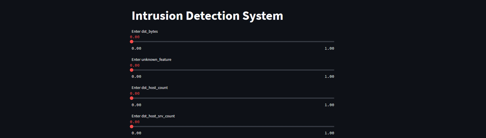
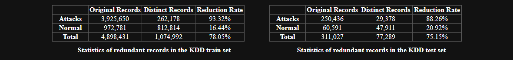
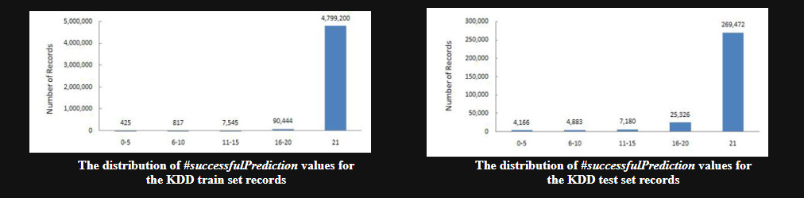

# Intrusion Detection System

This project implements an Intrusion Detection System (IDS) for network security, utilizing a Random Forest model to detect anomalies in network traffic.

## Introduction

Intrusion Detection Systems (IDS) play a crucial role in maintaining network security. This project focuses on creating an IDS using a Random Forest machine learning model. The system predicts whether incoming network traffic is normal or represents a potential anomaly. The project aims to contribute to network security by providing a tool that can efficiently identify and classify various network intrusions. The ultimate vision is to enhance cybersecurity measures, enabling quicker responses to potential threats and ensuring a safer network environment. <br>

The [Problem Statement](ProblemStatement.md)



## Features

- Utilizes a pre-trained Random Forest model to predict network traffic anomalies.
- Provides a simple and interactive web interface for users to input features.
- Enables users to visualize the predictions for network traffic.

## Getting Started

### Prerequisites

- Python 3.x
- Streamlit
- scikit-learn
- numpy
- pickle

### Installation

To get started with this project, follow these steps:

1. Clone the repository to your local machine:

```bash
git clone https://github.com/arindal1/anomaly-threat-hunter-ml.git
```

2. Navigate to the project directory:

```bash
cd anomaly-threat-hunter-ml
```

3. Create a Python virtual environment (recommended):

```bash
python -m venv venv
```

4. Activate the virtual environment:

```bash
# On Windows
venv\Scripts\activate

# On macOS and Linux
source venv/bin/activate
```

5. Install the project dependencies: [requirements.txt](requirements.txt)

```bash
pip install -r requirements.txt
```


6. Explore the Jupyter Notebook (`AnomalyDetectionInNetworkSecurity.ipynb`) for in-depth details on data preprocessing, model training, and evaluation.

7. To run the Streamlit app, execute the following command:

```bash
streamlit run app.py
```

## Usage

 To run the Streamlit app, execute the following command:

   ```bash
   streamlit run app.py
   ```

2. Access the app through your web browser at the provided URL (usually http://localhost:8501).
   
3. Input values for selected features.

4. Click "Predict" to get the system's prediction for network traffic.

## The Code

### Data Loading and Exploration:
- You start by loading a dataset using Pandas from a CSV file: `'NSL-KDD/KDDTest+.txt'`.
- You display a random sample of 5 rows from the dataset using `df.sample(5)`.
- You check the shape of the dataset using `df.shape`.
- You display information about the dataset using `df.info()`.

### Column Names and Categorical Encoding:
- You define a list of column names.
- You assign these column names to the DataFrame `df`.
- You identify categorical columns and perform one-hot encoding on them using `pd.get_dummies`.

### Numeric Features and Scaling:
- You identify numeric columns.
- You apply Min-Max scaling to these numeric columns using `MinMaxScaler`.

### Target Label:
- You preprocess the target variable `target` to label attacks as 1 and normal as 0.

### Data Visualization:
- You use various visualization techniques to understand the data, such as pie charts, correlation heatmap, pairplot, distribution plots, and boxplots.

### Feature Selection:
- You use Recursive Feature Elimination (RFE) with a RandomForestClassifier to select a certain number of features.

### Model Training:
- You split the dataset into features (`X`) and target (`y`).
- You split the data into training and testing sets using `train_test_split`.
- You train multiple models: RandomForestClassifier, SVM, Logistic Regression, and Neural Network (MLPClassifier).

### Model Evaluation:
- You evaluate the models using accuracy, precision, recall, false positive rate, area under ROC curve, and confusion matrix.

### Hyperparameter Tuning:
- You perform hyperparameter tuning using GridSearchCV for each model to find the best parameters.

### Ensemble Learning:
- You create an ensemble model using a VotingClassifier.

### Conclusion:
- You print the accuracy and metrics for each model, as well as the best parameters obtained from hyperparameter tuning.
- You also evaluate the ensemble model.

The code covers data preprocessing, visualization, feature selection, model training, evaluation, and hyperparameter tuning. It sets the stage for building a robust anomaly detection model, but further steps like selecting appropriate anomaly detection models and deploying the model are needed for a complete solution. If you have specific questions or need further clarification on any part, feel free to ask! <br>
For an in-depth breakdown of the [.ipynb](AnomalyDetectionInNetworkSecurity.ipynb) and [app.py](app.py) refer to [AboutTheCode.md](AboutTheCode.md).

## Dataset

The **NSL-KDD** dataset, short for *"NSL-KDD Network Traffic Data"*, is a widely used dataset in the field of intrusion detection and network security. It serves as a benchmark dataset for evaluating machine learning models and algorithms designed to detect various types of network intrusions.

### Key Features
- **Diversity:** The dataset includes a wide range of network intrusions, covering different attack types and protocols.
- **Realism:** The dataset is based on a more realistic representation of network traffic, addressing the shortcomings of the original KDD Cup 1999 dataset.
- **Labeling:** Each network connection in the dataset is labeled as either a normal connection or one of several attack types, allowing for supervised learning approaches.
- **Preprocessing:** The dataset provides preprocessed data, making it easier to apply machine learning techniques directly.




## Contributing

Contributions are welcome! For major changes, please open an issue first to discuss what you would like to change.
See the [open issues](https://github.com/arindal1/anomaly-threat-hunter-ml/issues) for a list of proposed features (and known issues). <br>
If you have any ideas, bug reports, or feature requests, please open an issue or submit a pull request. Contributions are what make the open-source community an amazing place to learn, inspire, and create. Any contributions you make are **greatly appreciated**.

1. Fork the Project
2. Create your Feature Branch (`git checkout -b feature/AmazingFeature`)
3. Commit your Changes (`git commit -m 'Add some AmazingFeature'`)
4. Push to the Branch (`git push origin feature/AmazingFeature`)
5. Open a Pull Request

## Contact

If you have any questions or suggestions related to this project, you can reach out to me at:

- GitHub: [arindal1](https://github.com/arindal1)
- LinkedIn: [arindalchar](https://www.linkedin.com/arindalchar/)

## External Links

- [NSL-KDD Dataset](https://www.unb.ca/cic/datasets/nsl.html)
- [NSL-KDD Documnetation](NSL-KDD/index.html)
- [Anomaly Detection Article](https://www.javatpoint.com/machine-learning-with-anomaly-detection#:~:text=Anomaly%20detection%20is%20a%20process,also%20known%20as%20outlier%20detection.)
- [StreamLit](https://docs.streamlit.io/)
- [Heroku](https://dashboard.heroku.com/apps)

---

**Note:** This is a personal project created for educational and demonstrative purposes. I made this project just for fun and learn more about Machine Learning in the process, and also record my progress in this field. Feel free to customize the content, links, and images to match your project's specifics.


### Keep coding and creating! 🤩
